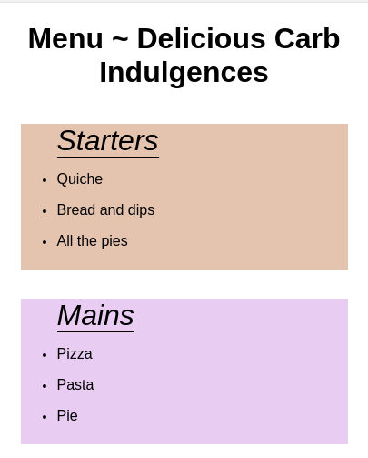

# Menü-Styling 
Im Repository gibt es eine Startdatei "index.html", die das Skelett eines Online-Menüs enthält. Gestalten Sie das Menü, indem Sie die folgenden Anweisungen befolgen. 

**Regeln**: 
* Alle Änderungen am Menü sollten in JavaScript vorgenommen werden! Kein CSS!!
* Die Seite sollte responsiv sein.

**Anweisungen**: 
* Ändern Sie die Schriftart des body-Elements. 
* Zentrieren Sie den Text von h1 auf der Seite.
* Die Menü-überschriften haben eine Klasse namens `category`. Wählen Sie die Elemente nach dem Klassennamen aus. Ändern Sie dann die "Farbe" und den "Schriftstil" (font-style) der einzelnen Elemente. 

* Wählen Sie die Warnung am Ende der Seite über die ID `Warnung` aus. Wählen Sie die ID aus, ohne einen querySelector zu verwenden. Ändern Sie die Größe und die Schriftart der "Warnung".
* Wählen Sie alle _geraden_ "Allergie-Infos" aus. Geben Sie den geraden Einträgen eine andere Hintergrundfarbe.
* Lassen Sie die "Allergie-Warnung" als eine Spalte in der Mitte der Seite erscheinen.
* Die Beschreibungen in der Fußzeile sollten ebenfalls gestylt werden, z. B. durch einen abgerundeten Rahmen mit einer Hintergrundfarbe. Sie sollten auf dem Handy in einer Spalte und auf dem Desktop in einer Zeile erscheinen.

**Bonus**

* Erstellen Sie eine Funktion namens "_colorGenerator_", die eine andere Farbe zurückgibt. Die zurückgegebene Zufallsfarbe sollte auch die eingestellte Transparenz enthalten. Wählen Sie die ungeordneten Listen mit der Klasse "food-category" aus. Geben Sie jeder Liste eine andere Hintergrundfarbe, indem Sie die von Ihnen erstellte Funktion verwenden. 
* Richten Sie die "food-category"-Listen auf dem Desktop in einer Reihe aus. Stellen Sie sicher, dass die Seite responsive ist und auch auf dem Handy funktioniert.

**Bilder**:

**Anmerkungen**:
* Folgen Sie den Anweisungen, um ein Menü zu erstellen. Sie können jedes zusätzliche Styling hinzufügen. 
* Deadline: 2 Stunden.
* Siehe Referenzbilder. 

---

# Menu Styling 
In the repository, there is an `index.html` starting file which has the skeleton of an online menu. Style the menu by following the instructions below. 

**Rules**: 
* All changes to the menu should be done in JavaScript! No CSS!!
* The page should be responsive.

**Instructions**: 
* Change the font of the body element. 
* Center the text of h1 on the page.
* The menu headings have a class named `category`. Select the elements by class name. Then, change the `color` and `font-style` of each element. 
* Select the warning at the end of the page by its id `warning`. Select the id without using a querySelector. Change the size and font of the `warning`.
* Select all _even_ `allergy-info` items. Give the even items a different background color.
* Make the `allergy-warning` appear as a column in the center of the page.
* The descriptions in the footer should also be styled, e.g. a rounded border with a background color. They should appear in a column for mobile and in a row for desktop.

**Bonus**

* Create a function named "_colorGenerator_" that returns a different color. The returned random color should also include set transparency. Select the unordered lists with the class of `food-category`. Give each list a different background color using the function that you created. 
* Align the `food-category` lists in a row on desktop. Make sure that the page is responsive and also works on mobile.
* 
**Images**:

**Notes**:
* Follow the instructions to create a menu. You can add any additional styling. 
* Deadline: 2hrs.
* See reference images. 

