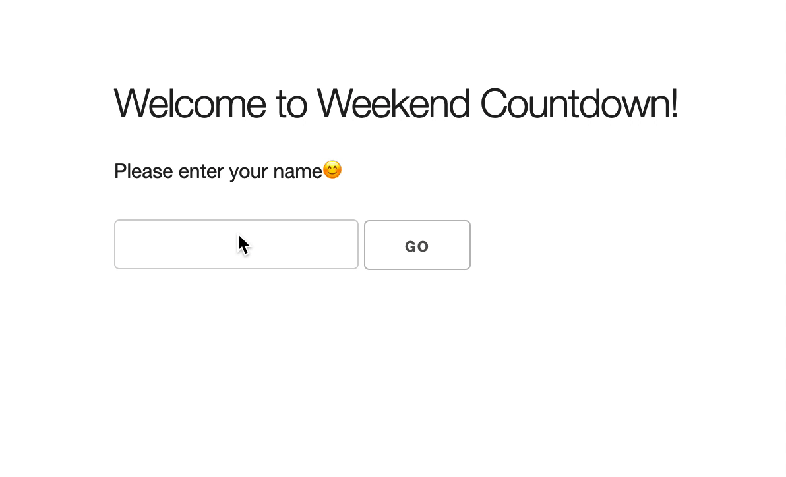

# Wochenend-Countdown

1. Erstellen Sie eine Miniapplikation, die den Namen eines Benutzers nimmt und folgendes zurückgibt;

    - Eine Begrüßung mit dem Namen des Benutzers.
    - Aktueller Tag
    - Verbleibende Tage bis zum Wochenende

1.  **Optional:** Gestalten Sie die App so, wie es Ihnen gefällt und laden/verwenden Sie Bootstrap über CDN.

> Tipp: Schauen Sie sich die Darstellung unten an, um eine Vorstellung davon zu bekommen, wie Ihr Ergebnis aussehen sollte.

# Weekend Countdown

1. Create a mini app that takes in a users name and returns the following;

    - A greeting with the users name.
    - Current day
    - Days left till the weekend

1.  **Optional:** Style to your pleasing & feel free to load/use bootstrap via CDN.

> Hint: Refer to the representation below, for an idea of what your result should look like.

