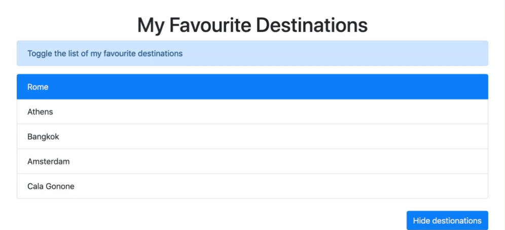

# Lieblingsorte Toggeln

Erstellen Sie eine Liste Ihrer Lieblingsziele mit einer Schaltfläche zum toggeln der Liste

**Voraussetzungen:**
- Bootstrap CDN verwenden
- Verwenden Sie `Element.classList` Methoden

**Beispiel:**

**Bonus:**

- Lassen Sie den Benutzer das bevorzugte Ziel auswählen
- Im Ereignisobjekt anzeigen
- Gestalten Sie die Liste nach Ihren Wünschen.

# Toggle Favourite Destinations

Create a list of your favourite destinations with a button to toggle the list

**Requirements:**
- use Bootstrap CDN
- use `Element.classList` methods

**Example:**

**Bonus:**

- Let the user select the favourite destination
- Show in the event object
- Style the list to your pleasing.

