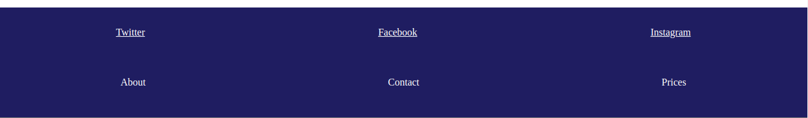

# Extreme Travel Website!

**Anweisungen**:
* Wählen Sie das Header Element, das der ersten Überschrift "h1" am nächsten ist. Gib dem Header einen festen Rahmen von 5px. 

* Wenn der Abschnitt `.info` ein `.info-package` enthält, wählen Sie alle `package-title` aus und geben dem Element vor dem Titel einen Rahmen. 

* Prüfen Sie, ob die Klasse des Labels "mild" ist. Wenn ja, wird das Label mit einem gelben Rahmen versehen. Wenn die Klasse des Labels mit "intensiv" übereinstimmt, erhält das Etikett einen orangefarbenen Rand. Stimmt die Klasse mit keiner der beiden Klassen überein, erhält das Etikett einen roten, durchgehenden Rahmen. 

* Fügen Sie alle Kinder der `.nav-list` zur ungeordneten Liste der Fußzeile, `.site-map`, hinzu. Hinweis: Die `.nav-list` sollte immer noch ihre Kinder enthalten. 

**Bonus**
Nachdem Sie die Aufgabe abgeschlossen und den Lösungszweig veröffentlicht haben, können Sie einen neuen Zweig `feature/restyle` erstellen und das Design der Landing-Page ändern. Sie können es auf GitHub Pages veröffentlichen, wenn Sie mit dem Ergebnis zufrieden sind.

**Anmerkungen**:
* Deadline: ~2hrs.
* Siehe Bilder als Referenz.

# Extreme Travel Website!

**Instructions**:
* Select the `header` that is the closest to the first `h1` heading. Give the `header` a solid border of 5px. 

* If the `.info` section contains an `.info-package`, select all `package-title`s and give the title's previous element a border. 

* Check if the label's class matches "mild". If so, give the label a yellow solid border. If the label's class matches "intense", give the label an orange solid border. If the class does not match either, give the label a red solid border. 

* Add all the children of the `.nav-list` to the footer's unordered list, `.site-map`. Note: the `.nav-list` should still contain its children. 

**Bonus**
After you completed the assignment and published the solution branch, you can create a new branch `feature/restyle` and change the design of the landing-page. You can publish it on GitHub Pages when you are satisfied with the result.

**Notes**:
* Deadline: ~2hrs.
* See images for reference.
