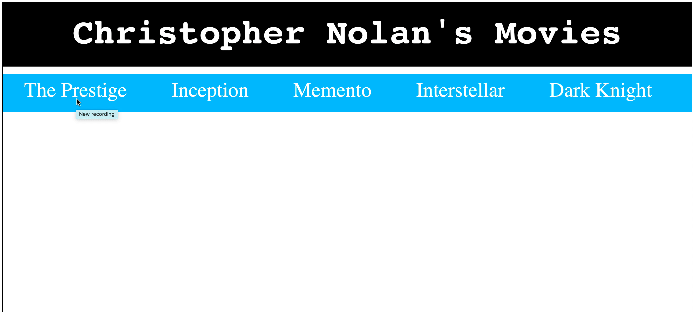

# Dropdown

1. Erstellen Sie eine Seite mit einer Kopfzeile und einer Dropdown-Navigation Ihres Lieblingsfilmregisseurs.

1. Jeder Dropdown-Navigationspunkt sollte ein Film sein (- von Ihrem Lieblingsregisseur) und sollte eine Liste der 3 Hauptdarsteller des Films anzeigen, wenn Sie darauf klicken.

1. **Optional:** Gestalten Sie nach Belieben.

> Tipp: Schauen Sie sich die Darstellung unten an, um eine Vorstellung davon zu bekommen, wie Ihr Ergebnis aussehen sollte.

---

1. Create a page with a header and dropdown navigation of your favourite movie director.

1. Each dropdown navigation item should be a movie (- from your favourite director) and should show a list of 3 star actors in the movie, when clicked.

1. **Optional:** Style to your pleasing.

> Hint: Refer to the representation below, for an idea of what your result should look like.

