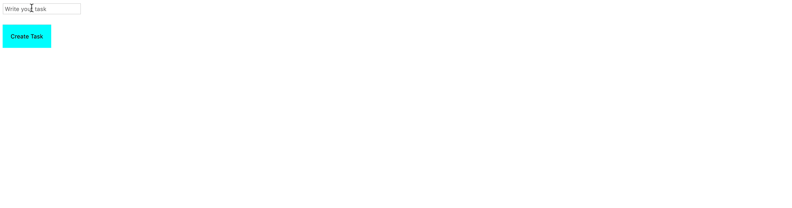

# To-Do List App

### Beschreibung:
- Mit dieser To-Do-Listen-App soll der Benutzer in der Lage sein, der To-Do-Liste Einträge hinzuzufügen. 
- Es gibt ein Eingabefeld, wo die Elemente hinzugefügt werden. 
- Der Benutzer kann diese Einträge auch über eine Button löschen.

1. Erstellen Sie eine To-Do-Listen-App mit einem Eingabefeld und einer Button zum Hinzufügen von To-Do's. Auf **submit** oder **click** sollte ein To-Do zur Liste der To-Do's hinzugefügt werden.

2. Fügen Sie eine Button _Löschen_ in Form von **X** hinzu, damit der Benutzer ein To-Do aus der Liste löschen kann.

3. **Optional:** Stil nach Belieben.

## Bonus
- Fügen Sie eine Button hinzu, um anzuzeigen, dass das Element erledigt ist. 
- Sie können ein Styling hinzufügen, um ein Element durchzustreichen.

> Tipp: Die folgende Darstellung zeigt Ihnen, wie Ihr Ergebnis aussehen sollte.

--- 

### Description:
- Through this To-Do List App, the user should be able to add items to the todo list. 
- There's an input field where the items are added. 
- The user can also delete these items through a button.

1. Create a TO-DO List app with an input field and button for adding To-Do's. On **Submit** or **Button-click**, a To-Do should be added to the list of To-Do's.

2. Add a _Delete_ button in the form of **X**, to enable the user delete a To-Do from the list.

3. **Optional:** Style to your pleasing.

## Bonus
- Add a button to show that the item is complete. 
- You can add styling to cross-out an item.

> Hint: Refer to the representation below, for an idea of what your result should look like.

